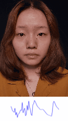
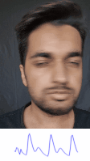
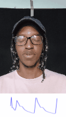
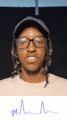
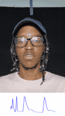
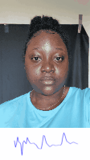

# MMPD[EMBC 2023]

## Abstract

**Here is [MMPD: Multi-Domain Mobile Video Physiology Dataset](<https://doi.org/10.48550/arXiv.2302.03840>) collected by Tsinghua University.**  
The Multi-domain Mobile Video Physiology Dataset (MMPD), comprising 11 hours(**1152K frames**) of recordings from mobile phones of 33 subjects. The dataset was designed to capture videos with greater representation across **skin tone, body motion, and lighting conditions**. MMPD is comprehensive with eight descriptive labels and can be used in conjunction with the [rPPG-toolbox](https://github.com/ubicomplab/rPPG-Toolbox).  


**Code is now updated in the `rPPG-Toolbox_MMPD` file fold, allowing users to choose any combination of multiple labels. More details would be uploaded soon.For those whose have downloaded or prepare to download our dataset: you are recommended to star this repo in case the dataset may be updated.**

```
@misc{tang2023mmpd,
      title={MMPD: Multi-Domain Mobile Video Physiology Dataset}, 
      author={Jiankai Tang and Kequan Chen and Yuntao Wang and Yuanchun Shi and Shwetak Patel and Daniel McDuff and Xin Liu},
      year={2023},
      eprint={2302.03840},
      archivePrefix={arXiv},
      primaryClass={cs.CV}
}
```

## Samples
|                           |LED-low|LED-high|Incandescent|Nature|
|:-------------------------:|:-----:|:------:|:----------:|:----:|
|Skin Tone 3<br />Stationary|||||
|Skin Tone 4<br />Rotation  |||||
|Skin Tone 5<br />Talking   |||||
|Skin Tone 6<br />Walking   |||||

## Access and Usage
**This dataset is built for academic use. Any commercial usage is banned.**  
To access the dataset, you are supposed to download this [letter of commitment](https://github.com/McJackTang/MMPD_rPPG_dataset/blob/main/Data%20Usage%20Protocol.pdf).  
Send an email to <tjk19@mails.tsinghua.edu.cn> and cc <yuntaowang@tsinghua.edu.cn> with the signed or sealed protocol as attachment.    
There are two kinds of dataset for convenience: full dataset(370G, 320 x 240 resolution ), mini dataset(48G, 80 x 60 resolution ).    
There are two ways for downloads： OneDrive and Baidu Netdisk for researchers of different regions.  For those researchers at China, hard disk could also be a solution.

## Experiment Procedure[Updated]  


## Distribution
<!DOCTYPE html>
<html lang="en">
<body>

<table border="6" width="500px" bgcolor="#f2f2f2" cellspacing="0" cellpadding="5" align="center">
    <thead>
        <tr bgcolor="#2e8b57">
            <th rowspan="2">Distribution</th>
            <th colspan="4">Skin Tone</th>
            <th colspan="2">Gender</th>
            <th colspan="2">Glasses Wearing</th>
            <th colspan="2">Hair Covering</th>
            <th colspan="2">Makeup</th>
        </tr>
        <tr bgcolor="#2e8b57">
            <th>3</th>
            <th>4</th>
            <th>5</th>
            <th>6</th>
            <th>Male</th>
            <th>Female</th>
            <th>True</th>
            <th>False</th>
            <th>True</th>
            <th>False</th>
            <th>True</th>
            <th>False</th>
        </tr>
    </thead>
    <tbody align="center" valign="middle">
        <tr>
        <td>Number</td>
        <td>16</td>
        <td>5</td>
        <td>6</td>
        <td>6</td>
        <td>16</td>
        <td>17</td>
        <td>10</td>
        <td>23</td>
        <td>8</td>
        <td>23</td>
        <td>4</td>
        <td>29</td>
    </tr>
</table>
</body>
</html>


## The Dataset Structure
```
MMPD_Dataset
├── subject1
    ├── p1_0.mat        # px_y.mat: x refers to the order of subjects, y refers to the order of the experiments, whcich is corresponding to the experiment procedure.
        ├── video       # Rendered images of the subjects at 320 x 240 resolution     [t, w, h, c]
        ├── GT_ppg      # PPG wavefrom signal                                         [t]
        ├── light       # 'LED-low','LED-high','Incandescent','Nature' 
        ├── motion      # 'Stationary','Rotation','Talking','Walking'
        ├── exercise    # True, False
        ├── skin_color  # 3,4,5,6
        ├── gender      # 'male','female'
        ├── glasser     # True, False
        ├── hair_cover  # True, False
        ├── makeup      # True, False
    ├── ... .mat
    ├── p1_19.mat
├── ...
├── subject33
```
 
Reading the data example:
 
```
import scipy.io as sio
f = sio.loadmat('p1_0.mat')
print(f.keys())
```

## Results(tested on MMPD)
### Simplest scenerio
In the simplest scenerio, we only include the stationary, skin tone type 3, and artificial light conditions as benchmark.
| METHODS      | MAE  | RMSE  | MAPE  | PEARSON |
|--------------|------|-------|-------|---------|
| ICA          | 8.75 | 12.35 | 12.26 | 0.21    |
| POS          | 7.69 | 11.95 | 11.45 | 0.19    |
| CHROME       | 8.81 | 13.18 | 12.95 | -0.03   |
| GREEN        | 10.57| 15.03 | 14.59 | 0.23    |
| LGI          | 7.46 | 11.92 | 10.12 | 0.12    |
| PBV          | 8.15 | 11.52 | 11.04 | 0.35    |
| TS-CAN(trained on PURE) | 1.78 |3.57 | 2.47 |0.93  |
| TS-CAN(trained on UBFC) | **1.46** | **3.13**  | **2.04**  | **0.94**   |

### Unsupervised Signal Processing Methods

We evaluated six traditional unsupervised methods in our dataset. In the skin tone comparison, we excluded the exercise, natural light, and walking conditions to eliminate any confounding factors and concentrate on the task at hand. Similarly, the motion comparison experiments excluded the exercise and natural light conditions, while the light comparison experiments excluded the exercise and walking conditions. This approach enabled us to exclude cofouding factors and better understand the unique challenges posed by each task.
<!--  -->

### Supervised Deep Learning Methods
In this paper, we investigated how state-of-the-art supervised neural network performs on MMPD and studied the influence of skin tone, motion, and light. We used the same exclusion criteria as the evaluation on unsupervised methods.
<!--  -->

  


## Citation
Title: [MMPD: Multi-Domain Mobile Video Physiology Dataset](https://doi.org/10.48550/arXiv.2302.03840)  
Jiankai Tang, Kequan Chen, Yuntao Wang, Yuanchun Shi, Shwetak Patel, Daniel McDuff, Xin Liu   


